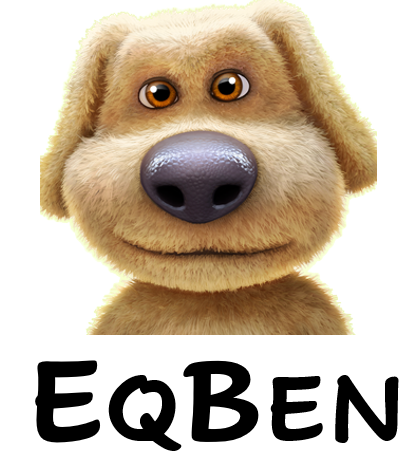

<br />
<p align="center">
  
  <h3 align="center"><strong>Equivariance Benchmark for Vision-Language Model (EqBen)</strong></h3>
  <p align="center">
      <a href="https://scholar.google.com/citations?hl=en&user=wFduC9EAAAAJ" target='_blank'>Tan Wang</a>,&nbsp;
      <a href="https://scholar.google.com/citations?hl=en&user=LKSy1kwAAAAJ" target='_blank'>Kevin Lin</a>,&nbsp;
      <a href="https://scholar.google.com/citations?hl=en&user=WR875gYAAAAJ" target='_blank'>Linjie Li</a>,&nbsp;
      <a href="https://scholar.google.com/citations?hl=en&user=legkbM0AAAAJ" target='_blank'>Chung-Ching Lin</a>,&nbsp;
      <a href="https://scholar.google.com/citations?hl=en&user=rP02ve8AAAAJ" target='_blank'>Zhengyuan Yang</a>,&nbsp;
      <a href="https://scholar.google.com/citations?hl=en&user=YG0DFyYAAAAJ" target='_blank'>Hanwang Zhang</a>,&nbsp;
      <a href="https://scholar.google.com/citations?hl=en&user=bkALdvsAAAAJ" target='_blank'>Zicheng Liu</a>,&nbsp;
      <a href="https://scholar.google.com/citations?hl=en&user=cDcWXuIAAAAJ" target='_blank'>Lijuan Wang</a>
    <br>
  Nanyang Technological University, &nbsp; Microsoft Corporation
  </p>


</p>

<p align="center">
  <a href="https://wangt-cn.github.io/" target='_blank'>
    
  </a>
  <a href="https://wangt-cn.github.io/" target='_blank'>
    
  </a>
  <a href="https://codalab.lisn.upsaclay.fr/competitions/10266" target='_blank'>
    
  </a>
  <a href="https://wangt-cn.github.io/" target='_blank'>
    
  </a>
</p>


## About

Welcome to the **EqBen**, which helps to benchmark your Vision-Language Pretrained (VLP) Model effectively and efficiently with a kind of fine-grained image-text matching task.

Compared to recent works ([Winoground](https://arxiv.org/abs/2204.03162v2) and [VALSE](https://aclanthology.org/2022.acl-long.567/)) focusing on minimal semantic changes in *captions*, EqBen pivots on **diverse visual-minimal changes**, automatically curated from time-varying visual contents in natural videos and synthetic engines with more precise control.

<br>

<p align="center">
  
  <figcaption align = "center"><b>Fig.1 EqBen</b></figcaption>
</p>

This repo contains an *one-stop and ready-to-use* ***pypi toolkit***, supporting multiple evaluation needs.


## What can you get from this Repo?

- 🙋‍♂️ **Q:** I just want to check the samples in EqBen.

  😁 **A:** No problem! Please check the examples in the below **Fig. 2**. Or you may want to check our paper for more construction details.

  

- 🙋‍♂️ **Q:** I want to try EqBen. How can I quickly use it?

  😻 **A:** Great! This repo can help you to add EqBen evaluation into your codebase within a few lines of code. Please follow the steps [here](https://github.com/Wangt-CN/EqBen#eqben).

  

- 🙋‍♂️ **Q:** I want to also evaluate my VL model on previous [Winoground](https://arxiv.org/abs/2204.03162v2) or [VALSE](https://aclanthology.org/2022.acl-long.567/) dataset.

  ✌️  **A:** We also support the convenient evaluation script of Winoground and VALSE. Please follow the steps [here](https://github.com/Wangt-CN/EqBen#winoground--valse).


## Installation & Usage

```
pip install eqben
```

Then it can be easily inserted into your VL model framework with little code addition. Here we provide a [**code** **template**](https://github.com/Wangt-CN/EqBen/blob/main/example/eqben_eval_template.py) and **examples ([#1](https://github.com/Wangt-CN/EqBen/blob/main/example/eqben_eval_CLIP.py) and [#2](https://github.com/Wangt-CN/EqBen/blob/main/example/eqben_eval_FIBER.py))** for 2 popular VL models (CLIP and FIBER). 

For the specific evaluation step, the users need to further download the data. Please check the following sections for details.


### EqBen
<p align="center">
  
  <figcaption align = "center"><b>Fig.2 The overview of our proposed benchmark EqBen, which consists of 5 sub-datasets and can be categorized to natural and synthetic.</b></figcaption>
</p>


##### 1. Data Download

The user can download the EqBen raw image data via [Google Clould](https://storage.googleapis.com/eqben-data/eqben.tar.gz).

##### 2. Modify Data Path

Please refer to the **[template (example)](https://github.com/Wangt-CN/EqBen/tree/main/example)** to modify the data path and annotation path. Then follow the example to insert EqBen evaluation code into your VL model framework.

##### 3. Submit to Server for Score

Running the evaluation script to get the `score.npy` file, then please submit to our [CodaLab](https://codalab.lisn.upsaclay.fr/competitions/10266) server after zip to obtain the final score. More details about the server evaluation please check the CodaLab website.

<br>

<br>

### Winoground & VALSE

<p align="center">
  
  <figcaption align = "center"><b>Fig.3 The overview of the VALSE evaluation set which focuses on the textual minimal change.</b></figcaption>
</p>


Our toolkit also supports the previous Winoground and VALSE benchmark. You can easily import them with following steps.

##### 1. Data Download

The user can download the raw data by following the official website of [Winoground](https://huggingface.co/datasets/facebook/winoground) and [VALSE](https://github.com/Heidelberg-NLP/VALSE).

##### 2. Modify Data Path

Please refer to the [**template (example)**](https://github.com/Wangt-CN/EqBen/tree/main/example) to modify the data path and annotation path. Then follow the example to insert EqBen evaluation toolkit into your VL model framework.

##### 3. Run the Script and Check the Score

The users can just check the offline score output.


<br>

### Acknowledgement
We thank the opensource projects of [Winoground](https://huggingface.co/datasets/facebook/winoground), [VALSE](https://github.com/Heidelberg-NLP/VALSE), [METER](https://github.com/zdou0830/METER), [FIBER](https://github.com/microsoft/FIBER) and [CLIP](https://github.com/openai/CLIP).