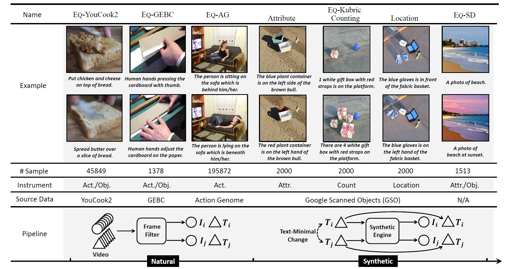

<br />
<p align="center">
  <h3 align="center"><strong>Equivariant Similarity for Vision-Language Foundation Models</strong></h3>
  <p align="center">
      <a href="https://scholar.google.com/citations?hl=en&user=wFduC9EAAAAJ" target='_blank'>Tan Wang</a>,&nbsp;
      <a href="https://scholar.google.com/citations?hl=en&user=LKSy1kwAAAAJ" target='_blank'>Kevin Lin</a>,&nbsp;
      <a href="https://scholar.google.com/citations?hl=en&user=WR875gYAAAAJ" target='_blank'>Linjie Li</a>,&nbsp;
      <a href="https://scholar.google.com/citations?hl=en&user=legkbM0AAAAJ" target='_blank'>Chung-Ching Lin</a>,&nbsp;
      <a href="https://scholar.google.com/citations?hl=en&user=rP02ve8AAAAJ" target='_blank'>Zhengyuan Yang</a>,&nbsp;
      <a href="https://scholar.google.com/citations?hl=en&user=YG0DFyYAAAAJ" target='_blank'>Hanwang Zhang</a>,&nbsp;
      <a href="https://scholar.google.com/citations?hl=en&user=bkALdvsAAAAJ" target='_blank'>Zicheng Liu</a>,&nbsp;
      <a href="https://scholar.google.com/citations?hl=en&user=cDcWXuIAAAAJ" target='_blank'>Lijuan Wang</a>
    <br>
  Nanyang Technological University, &nbsp; Microsoft Corporation
  </p>

</p>

<p align="center">
  <a href="https://arxiv.org/abs/2303.14465" target='_blank'>
    
  </a>
  <a href="https://codalab.lisn.upsaclay.fr/competitions/10266" target='_blank'>
    
  </a>
  <a href="https://entuedu-my.sharepoint.com/:b:/g/personal/tan317_e_ntu_edu_sg/EUeL5VNXA2ZIng1zd-zH_ccBLBvcVpc5dqysriFtseR33A?e=BhhQJk" target='_blank'>
    
  </a>
</p>


<p align="center">

Our proposed EqBen is the first benchmark to focus on "visual-minimal change" to diagnose the Vision-Language foundation models.
</p>


<br>


# News

- Our Paper has been accepted by ICCV 2023 (Oral) !

- We perform some toy experiments for recent popular Multimodal Large Language Model (**MLLM**) on EqBen and observe much inferior results of MiniGPT4 (see below). We also release a [small EqBen subset](https://entuedu-my.sharepoint.com/:u:/g/personal/tan317_e_ntu_edu_sg/ETkpKSsmun1MpBw7FqfUUS8BwTX2gKkTQkDFsfOGCw-9yA?e=KGtpg0) to quantitatively measure the performances of MLLM. Please refer more details and results in Appendix A.4. 

  <p align="center">
  
  MiniGPT4 response for a random sample of the proposed EqBen and it is totally wrong.
  </p>


# About

This study explores the concept of equivariance in vision-language foundation models (VLMs), focusing specifically on the multimodal similarity function that is not only the major training objective but also the core delivery to support downstream tasks. Unlike the existing image-text similarity objective which only categorizes matched pairs as similar and unmatched pairs as dissimilar, equivariance also requires similarity to vary faithfully according to the semantic changes. Our key contributions are three-fold:

1. A novel benchmark named **EqBen** (Equivariant Benchmark) to benchmark VLMs with **visual-minimal change** samples.
2. A plug-and-play regularization loss **EqSim** (Equivariant Similarity Learning) to improve the equivariance of current VLMs.
3. Our toolkit (this repo) provide an **one-stop evaluation**: not only for our EqBen, but also for previous related benchmarks (Winoground, VALSE, etc).<br>

<p align="center">

</p>

<br><br />

# ToDo List

- [x] Add a subset (10% of the full EqBen, ~**25k** image-text pairs) for the ease of visualization/validation (Please check it [here](https://github.com/Wangt-CN/EqBen#1-data-download))

- [ ] Full evaluation metric on the CodaLab server

  

# What can you get from this Repo?

- 🙋‍♂️ **Q:** I just want to check the samples in EqBen.

  😁 **A:** No problem! Please check the examples in the below figure. Or you may want to check our paper for more construction details.

  

- 🙋‍♂️ **Q:** I want to try EqBen. How can I quickly use it?

  😻 **A:** Great! This repo can help you to add EqBen evaluation into your codebase within a few lines of code. Please follow the steps [here](https://github.com/Wangt-CN/EqBen#eqben).

  

- 🙋‍♂️ **Q:** I want to also evaluate my VL model on previous [Winoground](https://arxiv.org/abs/2204.03162v2) or [VALSE](https://aclanthology.org/2022.acl-long.567/) dataset.

  ✌️  **A:** We also support the convenient evaluation script of Winoground and VALSE. Please follow the steps [here](https://github.com/Wangt-CN/EqBen#winoground--valse).

  

- 🙋‍♂️ **Q:** I want to try your proposed algorithm EqSim.

  🌟 **A:** Please check the implementation of EqSim [here](https://github.com/Wangt-CN/EqBen/tree/main/EqSim).


<br><br />

# EqBen

Welcome to the **EqBen**, which helps to benchmark your Vision-Language Pretrained (VLP) Model effectively and efficiently with a kind of fine-grained image-text matching task. Compared to recent works ([Winoground](https://arxiv.org/abs/2204.03162v2) and [VALSE](https://aclanthology.org/2022.acl-long.567/)) focusing on minimal semantic changes in *captions*, EqBen pivots on **diverse visual-minimal changes**, automatically curated from time-varying visual contents in natural videos and synthetic engines with more precise control.

<br>

<p align="center">
    <br />
  Core Design of our EqBen: "Visual-Minimal Change"
</p>

​                                                                                                                       


This repo contains an *one-stop and ready-to-use* ***pypi toolkit***, supporting multiple evaluation needs.

<br>

## Installation & Usage

```
pip install eqben
```

It's all set! Then it can be easily inserted into your VL model framework with little code addition. Here we provide a [**code** **template**](https://github.com/Wangt-CN/EqBen/blob/main/example/eqben_eval_template.py) and **examples ([#1](https://github.com/Wangt-CN/EqBen/blob/main/example/eqben_eval_CLIP.py) and [#2](https://github.com/Wangt-CN/EqBen/blob/main/example/eqben_eval_FIBER.py))** for 2 popular VL models (CLIP and FIBER). 

For the specific evaluation step, the users need to further download the data. Please check the following sections for details.

<br>

### EqBen
<p align="center">
  
  The overview of our proposed benchmark EqBen, which consists of 5 sub-datasets and can be categorized to natural and synthetic.
</p>
​                     


##### 1. Data Download

- Full-Test Set: the user can download the EqBen raw **[image data](https://storage.googleapis.com/eqben-data/eqben_image_full.tar.gz)** (tar.gz file, ~100G) and [**annotation**](https://storage.googleapis.com/eqben-data/eqben_ann/ann_json_finegrained_random.json) (200M) via Google Clould .

- Sub-Test Set: we also provide a 10% subset (~25K image-text pairs) for the ease of visualization and validation. The label of the EqBen sub-set is **opensource** and the **format follows the winoground style**. But please note that the samples in the subset is **randomly sorted** and not be classified to each category. Please down the raw **[image data](https://storage.googleapis.com/eqben-data/eqben_subset/subset_image.tar.gz)** (tar.gz file, ~10G) and [**annotation**](https://storage.googleapis.com/eqben-data/eqben_subset/eqben_subset_10percent_final.json) via Google Cloud.

##### 2. Modify Data Path

Please refer to the **[template (example)](https://github.com/Wangt-CN/EqBen/tree/main/example)** to modify the data path and annotation path. Then follow the example to insert EqBen evaluation code into your VL model framework.

##### 3. Submit to Server for Score

Running the evaluation script to get the `score.npy` file, then please submit to our [CodaLab](https://codalab.lisn.upsaclay.fr/competitions/10266) server after zip to obtain the final score. More details about the server evaluation please check the CodaLab website.

<br>


### Winoground & VALSE

<p align="center">
  
   The overview of the VALSE evaluation set which focuses on the textual minimal change.
</p>
​                                                    


Our toolkit also supports the previous Winoground and VALSE benchmark. You can easily import them with following steps.

##### 1. Data Download

The user can download the raw data by following the official website of [Winoground](https://huggingface.co/datasets/facebook/winoground) and [VALSE](https://github.com/Heidelberg-NLP/VALSE).

##### 2. Modify Data Path

Please refer to the [**template (example)**](https://github.com/Wangt-CN/EqBen/tree/main/example) to modify the data path and annotation path. Then follow the example to insert EqBen evaluation toolkit into your VL model framework.

##### 3. Run the Script and Check the Score

The users can just check the offline score output.

<br><br />

# EqSim

Our EqSim stems from an intuitive example as below, where we depict the similarity scores produced by the current SOTA VLMs FIBER (pretrained on open-source data).

<p align="center">
  
</p>

We can find that, FIBER mistakenly assigns a higher similarity score to $\{I_1,T_2\}$ rather than $\{I_1,T_1\}$ ($3.83$ v.s. $3.79$). Furthermore, the changes in similarity scores guided by the semantic change (2$\leftrightarrow$3) are highly inconsistent ($+0.04$ v.s. $-1.81$).  Therefore, the key idea of our EqSim is to regularize the consistency between the two simiarity changes.

Please check the [sub-folder](https://github.com/Wangt-CN/EqBen/tree/main/EqSim) for implementation.


<br>

### Acknowledgement
We thank the valuable disscusions with Ziyi Dou. We thank the opensource projects of [Winoground](https://huggingface.co/datasets/facebook/winoground), [VALSE](https://github.com/Heidelberg-NLP/VALSE), [METER](https://github.com/zdou0830/METER), [FIBER](https://github.com/microsoft/FIBER) and [CLIP](https://github.com/openai/CLIP). 
